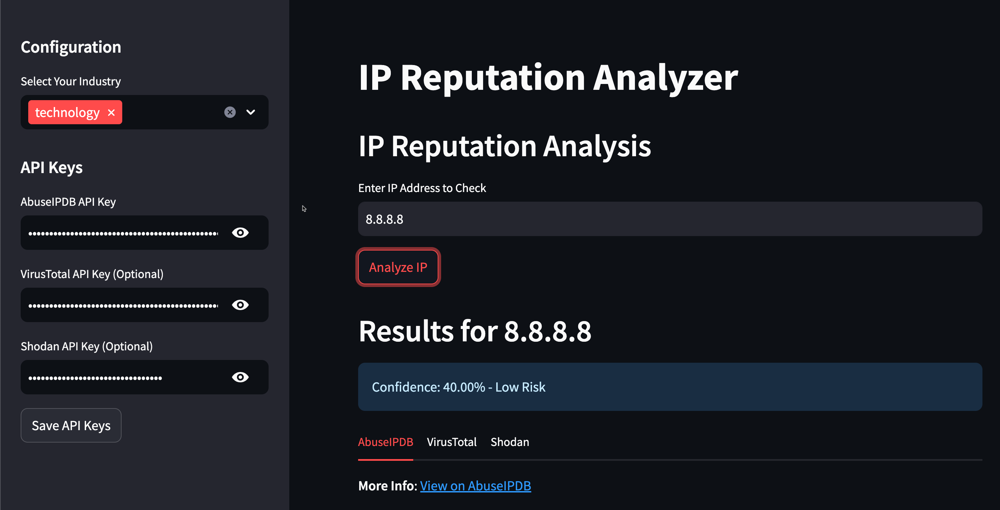

# Threat Intelligence Analyzer

A Streamlit application that analyzes IP addresses for reputation and security risks by querying multiple open-source intelligence sources.

By Ismael Valenzuela @aboutsecurity @thinkredactblue

Join the All Around Defender Discord channel here:
https://sec530.com/discord.php

## Features

### IP Analysis
- IP address validation and enrichment
- Multi-source intelligence gathering (AbuseIPDB, VirusTotal, Shodan)
- Rate limiting to prevent API abuse
- Comprehensive error handling
- Custom confidence scoring based on:
  - Reputation scores from multiple sources
  - Presence in multiple threat intelligence sources
  - Recency of reports
  - Relevance to your industry



## Installation

1. Clone this repository:
```bash
git clone https://github.com/yourusername/ip-reputation.git
cd ip-reputation
```

2. Install the required dependencies:
```bash
pip install -r requirements.txt
```

3. Set up your API keys:
```bash
cp .env.example .env
```
Then edit the `.env` file to add your API keys.

## API Keys

The application requires the following API keys:

- AbuseIPDB: Required for IP analysis - [Get API key](https://www.abuseipdb.com/account/api)
- VirusTotal: Required for Domain analysis, recommended for IP analysis - [Get API key](https://www.virustotal.com/gui/join-us)
- Shodan: Optional for additional IP intelligence - [Get API key](https://account.shodan.io/)
- CertSpotter: Optional for better certificate transparency monitoring - [Get API key](https://sslmate.com/certspotter/api/)

## Usage

1. Start the application:
```bash
streamlit run app.py
```

2. Open your browser and navigate to `http://localhost:8501`

3. Choose the analysis tab:
   - For IP analysis: Enter an IP address and click "Analyze IP"
   - For Domain analysis: Enter a domain and click "Analyze Domain"

4. The results will display:
   - For IPs:
     - Overall confidence score and risk classification
     - Detailed information from each intelligence source
     - Raw response data (expandable)
   - For Domains:
     - VirusTotal reputation information
     - List of registered lookalike domains that might be used for phishing
     - Certificate transparency information for suspicious domains

## Confidence Score Calculation

The application calculates a confidence score (0-100%) based on:

- **Multiple Sources (30%):** Higher score for IPs found in multiple intelligence sources
- **Reputation (30%):** Based on AbuseIPDB confidence score and VirusTotal detections
- **Recency (25%):** Higher score for more recent reports
- **Industry Relevance (15%):** Higher score for IPs associated with attacks on your industry

## Contributing

Contributions are welcome! Please feel free to submit a Pull Request.

## License

This project is licensed under the MIT License - see the LICENSE file for details.